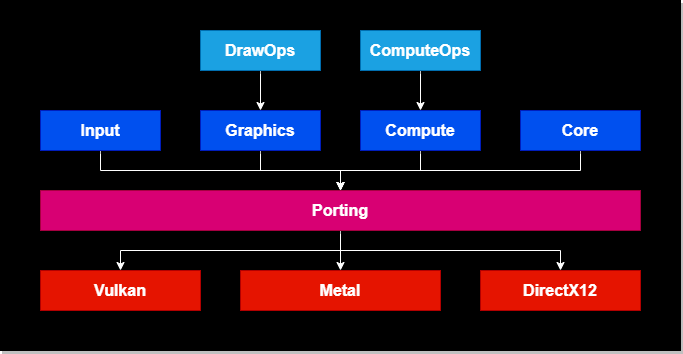
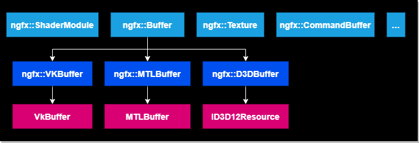

# NGFX Graphics Framework

NGFX is a low level graphics framework, providing an abstraction API on 
top of Vulkan, DirectX12, and Metal.  It exposes the benefits of 
next-generation graphics technology via a common platform abstraction 
API.  It also supports optional access to the backend data structures, 
enabling platform specific optimizations.

---

## Source Code

<https://github.com/gopro/ngfx>

---

## High Level Architecture



---

## Low Level Architecture



The ngfx graphics classes provide high-level abstractions on top of 
various graphics objects, including Buffer, Texture, Renderpass, 
Swapchain, Surface, CommandBuffer, etc.  Each backend (Vulkan, Metal, 
DirectX12) is responsible for implementing the high-level abstraction 
interface via a subclass.

The user can construct 3D graphics commands using these high-level 
abstractions.  Optionally, the user can access the backend-specific 
data by casting the high-level object to a backend-specific subclass.

For example: 
```
Buffer *buffer = Buffer::create(...);
VKBuffer *vkBuffer = (VKBuffer*)buffer;
```

From there, the user can access platform specific data, including the 
underlying Vulkan buffer object, etc.  This provides a high degree of 
flexibility, where the user can primarily use platform-agnostic code, 
while still being able to use platform-specific code for 
high-performance optimizations, and for achieving optimal interaction 
with the platform.

---

## Build Instructions

**1) Install Dependencies**

1.1) Install Platform-Specific Dependencies

*On Windows 10 (or newer):*

  Install Microsoft Visual Studio 2019 (or newer)

  Install Windows Subsystem for Linux (Ubuntu 20.04.1 LTS or newer)
  - Note: Git Bash or MSYS2 should work too

*On Linux (Ubuntu 20.04.1 or newer, other Linux distros should work too):*

  Install GNU Toolchain (apt install build-essential)

*On Mac:*

  Install XCode

1.2) Install Common System Dependencies

Install CMake 3.19.1 (or newer)

1.3) Install Third-Party Dependencies

*ngfx has the following dependencies:*

- nlohmann/json 3.9.1 (or newer)
- stb_image 2.26 (or newer)
- glm 0.9.9.8 (or newer)
- RenderDoc 1.11_64 (or newer, on Windows and Linux)
- d3dx12.h v10.0.17763.0 (or newer, on Windows)
- glfw 3.3.2 (or newer, on Windows and Linux)
- shaderc v2020.4 (or newer)
- spirv-cross 2021-01-15 (or newer)
- vulkan sdk 1.2.162.1 (or newer, if using Vulkan backend)

We provide a helper script to help install 3rd-party dependencies

`OS=*os* python build_scripts/install_deps.py`

- *os*: Windows, Linux, or Darwin (Mac OS)

**2) Configure**

`cmake.exe -H. -B*build_folder* -DCMAKE_BUILD_TYPE=*build_type* -D*ngfx_graphics_backend*=ON -G *cmake_generator*`

- *build_folder*: the build output folder 
(e.g. cmake-build-debug, or cmake-build-release)
- *build type*: Debug or Release
- *ngfx_graphics_backend*: the graphics backend 
(NGFX_GRAPHICS_BACKEND_VULKAN, NGFX_GRAPHICS_BACKEND_METAL, or 
NGFX_GRAPHICS_BACKEND_DIRECT3D12)
- *cmake_generator*: CMake generator (e.g. Visual Studio 16 2019)

Example:

`cmake.exe -H. -Bcmake-build-debug -DCMAKE_BUILD_TYPE=Debug -DNGFX_GRAPHICS_BACKEND_DIRECT3D12=ON`

We provide a helper script to configure

`OS=*os* bash build_scripts/configure.sh`

- *os*: Windows, Linux, or Darwin (Mac OS)

**3) Build**

From command line: 

`cmake.exe --build *build_folder*`

Alternatively, can build from IDE

We provide a helper script to build

`OS=*os* bash build_scripts/build.sh`

- *os*: Windows, Linux, or Darwin (Mac OS)

**4) Install**

`cmake.exe --install *build_folder* --config *build_type*`

We provide a helper script to build

`OS=*os* bash build_scripts/install.sh`

- *os*: Windows, Linux, or Darwin (Mac OS)

---

## API Documentation

<https://gopro.github.io/ngfx/api/Classes/>

---

## Contributing

**Coding Style Guidelines**

We use clang-format to automatically enforce coding style.
We use llvm coding style (the default option in clang-format).
To automatically apply formatting: run build_scripts/clang_format.sh

The LLVM coding style can be referenced here: 
See <https://llvm.org/docs/CodingStandards.html>

We use doxygen, with JavaDoc-style annotations to generate API 
documentation.
