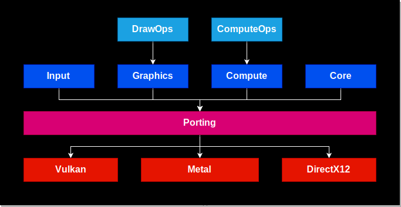
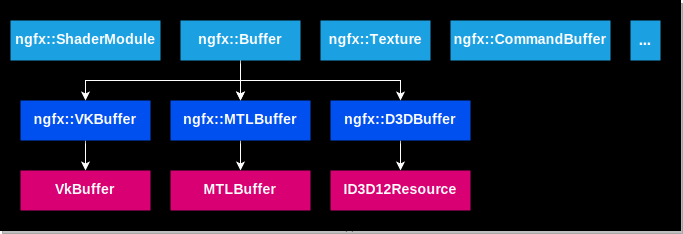
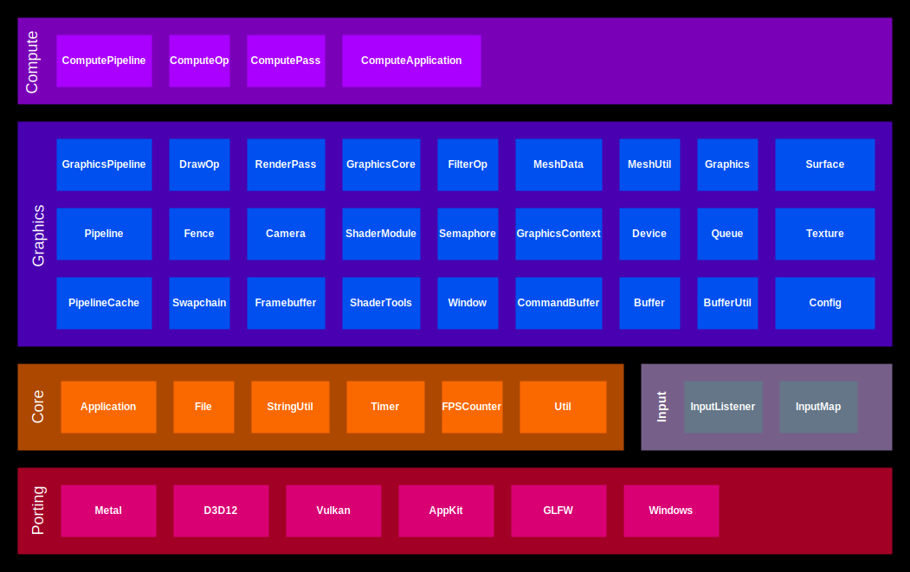

# NGFX Graphics Framework

NGFX is a low level graphics framework, providing an abstraction API on 
top of Vulkan, DirectX12, and Metal.  It exposes the benefits of 
next-generation graphics technology via a common platform abstraction 
API.  It also supports optional access to the backend data structures, 
enabling platform specific optimizations.

---

## Source Code

<https://github.com/gopro/ngfx>

---

## High Level Architecture



---

## Low Level Architecture



The ngfx graphics classes provide high-level abstractions on top of 
various graphics objects, including Buffer, Texture, Renderpass, 
Swapchain, Surface, CommandBuffer, etc.  Each backend (Vulkan, Metal, 
DirectX12) is responsible for implementing the high-level abstraction 
interface via a subclass.

The user can construct 3D graphics commands using these high-level 
abstractions.  Optionally, the user can access the backend-specific 
data by casting the high-level object to a backend-specific subclass.

For example: 
```
Buffer *buffer = Buffer::create(...);
VKBuffer *vkBuffer = (VKBuffer*)buffer;
```

From there, the user can access platform specific data, including the 
underlying Vulkan buffer object, etc.  This provides a high degree of 
flexibility, where the user can primarily use platform-agnostic code, 
while still being able to use platform-specific code for 
high-performance optimizations, and for achieving optimal interaction 
with the platform.

## Modules



| Module | Description |
| ------ | ----------- |
| ComputePipeline | Programs the modules on the GPU related to compute operations. In particular, defines the compute shader input and various portions of the GPU pipeline layout.
| ComputeShader | Defines a programmable shader that can perform arbitrary computation.
| ComputeOp | Defines the base interface for compute operations. Provides support for performing one or more compute operations. Describes the inputs, outputs, intermediate buffers, and layout transitions.  
| ComputeApplication | A helper class for creating an application that performs compute operations.
| GraphicsPipeline | Defines the input to the shader stages (vertex, fragment, geometry, tessellation, etc), and GPU pipeline layout.
| DrawOp | Defines the base class for draw operations.
| RenderPass | Provides support for performing one or more draw operations. Describes the inputs, outputs, intermediate buffers, and layout transitions.
| GraphicsCore | Defines various graphics data types such as BlendOp, BlendFactor, etc.
| FilterOp | Defines the base interface for image filters.
| MeshData | Defines the data for a 3D mesh.
| MeshUtil | Provides various mesh utility functions.
| Graphics | Defines various graphics commands via a high level abstraction API.  Also provides various profiling functions.
| Surface | Defines a high-level abstraction for a platform surface. A surface is essentially a buffer of memory along with an associated pixel format.
| Texture | Defines a high-level abstraction for a GPU texture. A texture consists of an organized array of texels along with the texture format. In addition, a texture supports random sampling on the GPU. Supports various types of textures including 2D, 3D, 2D arrays, cubemaps, etc. Also supports mipmapping.
| Pipeline | Programs the GPU pipeline modules, including the input assembler, shader stages, rasterizer, blend parameters, etc.
| Fence | Supports GPU-CPU synchronization.  Notifies the CPU when some operation on the GPU is completed.
| Camera | Provides an orbital camera that supports pan / tilt / zoom. Supports keyboard, mouse, and touch input
| ShaderModule | Defines the base class for programmable shader modules. A programmable shader allows the user to write code in a high-level shading language that performs arbitrary graphics or computation on the GPU. Supports precompiled shaders for optimal performance. Also supports runtime shader compilation although this usage is discouraged. Supports GLSL (in Vulkan backend), HLSL (in DirectX12 backend) and MSL (in Metal backend), along with the associated precompiled formats (spirv, dxc, metallib). The user can either program in a platform-specific shading language, or program in GLSL and the code can be auto-converted to HLSL / MSL for other platforms (see ShaderTools).
| ShaderTools | Provides support for auto-converting GLSL to HLSL / MSL. Uses spirv-cross internally to convert the shaders. Supports offline shader conversion for optimal performance and more importantly, validation. Also supports runtime shader conversion although this usage is discouraged.
| VertexShaderModule | Defines the shader input to the vertex shader module.
| FragmentShaderModule | Defines the shader input to the fragment shader module.
| ComputeShaderModule | Defines the shader input to the compute shader module
| Semaphore | Support GPU-GPU synchronization. Synchronizes GPU operations within or across command queues. The main difference between fences and semaphores is that fences can be accessed from your program (on the CPU) while semaphores are only accessible within the GPU.
| Barrier   | 
| GraphicsContext | 
| Device | Defines a logical abstraction for a GPU device.  Also has logic to query the devices in the system and choose the device based on capabilities, although this logic will probably be moved.
| Queue | Defines a logical abstraction for a GPU queue.  Commands are recorded to CommandBuffers and submitted to the GPU via queues.  Queues can support up to 3 uses: compute, transfer, and graphics.
| Swapchain | Manages a set of images (typically 2 or 3) that are presented to the display.  Supports various present modes.
| Framebuffer | Supports rendering to one or more textures via attachments.
| Window | Provides a high-level window abstraction, and has logic for creating the window and handling resizing, input events, etc.  NGFX currently supports various window backends: glfw, Windows, appkit, etc.  NGFX also supports rendering directly to a surface (which can be existing window surface or an offscreen surface).
| CommandBuffer | Supports recording multiple commands and submitting them to the GPU.  Supports both primary and secondary command buffers.  Secondary command buffers can be recorded in parallel, using multiple threads, and added to a primary command buffer.  
| Buffer | Supports GPU buffers.  A buffer is an unorganized block of data.  The same buffer can support multiple usage scenarios, including storing uniform data, vertex buffer data, index buffer data, etc.  On shared memory architectures, supports shared CPU/GPU access.  For discrete GPUs, supports uploading / downloading to dedicated GPU memory. 
| BufferUtil | Provides various helper functions for creating specialized buffers.
| Config | Defines various configuration options.
| Application | Defines the base class for an application interface, which is an optional module that simplifies creating an application.
| File | Supports file operations.
| StringUtil | Supports various string operations.
| RegexUtil | Provides various regex utility functions.
| Timer | Provides a basic timer that measures elapsed time.  
| FPSCounter | Supports measing FPS (frames per second).
| Util | Various utility functions.
| InputListener | Defines the base interface for an object that can respond to input events.
| InputMap | Provides a common abstraction for input codes (such as key codes).

---

## Build Instructions

**1) Install Dependencies**

1.1) Install Platform-Specific Dependencies

*On Windows 10 (or newer):*

  Install Microsoft Visual Studio 2019 (or newer)

  Install PowerShell Core version 7.1.3 (or newer)

*On Linux (Ubuntu 20.04.1 or newer, other Linux distros should work too):*

  Install GNU Toolchain (apt install build-essential)

*On Mac:*

  Install XCode

1.2) Install Common System Dependencies

Install CMake 3.19.1 (or newer)

1.3) Install Third-Party Dependencies

*ngfx has the following dependencies:*

- nlohmann/json 3.9.1 (or newer)
- stb_image 2.26 (or newer)
- glm 0.9.9.8 (or newer)
- RenderDoc 1.11_64 (or newer, on Windows and Linux)
- d3dx12.h v10.0.17763.0 (or newer, on Windows)
- glfw 3.3.2 (or newer, on Windows and Linux)
- shaderc v2020.4 (or newer)
- spirv-cross 2021-01-15 (or newer)
- vulkan sdk 1.2.162.1 (or newer, if using Vulkan backend)

We provide a helper script to help install 3rd-party dependencies

`OS=*os* python build_scripts/install_deps.py`

- *os*: Windows, Linux, or Darwin (Mac OS)

**2) Configure**

`cmake.exe -H. -B*build_folder* -DCMAKE_BUILD_TYPE=*build_type* -D*ngfx_graphics_backend*=ON -G *cmake_generator*`

- *build_folder*: the build output folder 
(e.g. cmake-build-debug, or cmake-build-release)
- *build type*: Debug or Release
- *ngfx_graphics_backend*: the graphics backend 
(NGFX_GRAPHICS_BACKEND_VULKAN, NGFX_GRAPHICS_BACKEND_METAL, or 
NGFX_GRAPHICS_BACKEND_DIRECT3D12)
- *cmake_generator*: CMake generator (e.g. Visual Studio 16 2019)

Example:

`cmake.exe -H. -Bcmake-build-debug -DCMAKE_BUILD_TYPE=Debug -DNGFX_GRAPHICS_BACKEND_DIRECT3D12=ON`

We provide a helper script to configure

`OS=*os* python build_scripts/configure.py`

- *os*: Windows, Linux, or Darwin (Mac OS)

**3) Build**

From command line: 

`cmake.exe --build *build_folder*`

Alternatively, can build from IDE

We provide a helper script to build

`OS=*os* python build_scripts/build.py`

- *os*: Windows, Linux, or Darwin (Mac OS)

**4) Install**

`cmake.exe --install *build_folder* --config *build_type*`

We provide a helper script to build

`OS=*os* python build_scripts/install.py`

- *os*: Windows, Linux, or Darwin (Mac OS)

---

## API Documentation

<https://gopro.github.io/ngfx/api/Classes/>

---

## Contributing

Any feedback, suggestions, and contributions are greatly welcomed.
Please don't hesitate to share suggestions to improve the architecture,
APIs, design, or contribute to the code.

**Coding Style Guidelines**

We use clang-format to automatically enforce coding style.
We use llvm coding style (the default option in clang-format).
To automatically apply formatting: run build_scripts/clang_format.sh

The LLVM coding style can be referenced here: 
See <https://llvm.org/docs/CodingStandards.html>

We use doxygen, with JavaDoc-style annotations to generate API 
documentation.
